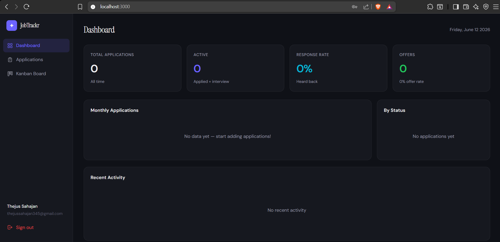

# JobTrackr — Full Stack Job Application Tracker

A production-grade full stack web application to track job applications through the entire hiring pipeline. Built with **React**, **Django REST Framework**, **PostgreSQL**, and **Docker**.

    


---

## Features

- **JWT Authentication** — Register, login, auto token refresh, secure logout
- **Full CRUD** — Create, read, update, delete job applications
- **Kanban Board** — Drag-and-drop cards across status columns
- **Analytics Dashboard** — Bar charts, pie charts, response rate, offer rate
- **Advanced Filtering** — Filter by status, work type, search by company/position
- **Interview Tracking** — Schedule and manage interview rounds per application
- **Tag System** — Create custom color tags for applications
- **RESTful API** — Clean API design with pagination, filtering, ordering
- **Docker Support** — One-command setup with Docker Compose

---

## Tech Stack

| Layer | Technology |
|---|---|
| Frontend | React 18, React Router v6, TanStack Query, Recharts |
| Backend | Python 3.12, Django 5.0, Django REST Framework 3.15 |
| Auth | JWT (SimpleJWT) with access + refresh token rotation |
| Database | PostgreSQL 15 |
| DevOps | Docker, Docker Compose, Gunicorn |
| API Patterns | ViewSets, Routers, FilterSets, Custom Actions |

---

## Project Structure

```
jobtracker/
├── backend/
│   ├── apps/
│   │   ├── accounts/          # Custom User model, JWT auth
│   │   │   ├── models.py
│   │   │   ├── serializers.py
│   │   │   ├── views.py
│   │   │   └── urls.py
│   │   └── jobs/              # Core application logic
│   │       ├── models.py      # JobApplication, Interview, Tag
│   │       ├── serializers.py
│   │       ├── views.py       # ViewSets + dashboard analytics
│   │       ├── filters.py
│   │       └── urls.py
│   ├── jobtracker/
│   │   ├── settings.py
│   │   └── urls.py
│   ├── requirements.txt
│   ├── Dockerfile
│   └── manage.py
├── frontend/
│   ├── src/
│   │   ├── components/
│   │   │   ├── Layout.jsx         # Sidebar navigation shell
│   │   │   └── ApplicationModal.jsx
│   │   ├── context/
│   │   │   └── AuthContext.jsx    # Global auth state
│   │   ├── pages/
│   │   │   ├── Dashboard.jsx      # Charts + stats
│   │   │   ├── Applications.jsx   # Table with search/filter
│   │   │   ├── KanbanBoard.jsx    # Drag-and-drop board
│   │   │   ├── Login.jsx
│   │   │   └── Register.jsx
│   │   ├── services/
│   │   │   └── api.js             # Axios + JWT interceptors
│   │   └── App.jsx
│   ├── package.json
│   └── Dockerfile
├── docker-compose.yml
└── .gitignore
```

---

## Quick Start

### Option 1: Docker Compose (Recommended)

```bash
# 1. Clone the repo
git clone https://github.com/xxgopalanxx/Job_tracker.git
cd jobtracker

# 2. Create backend .env
cp backend/.env.example backend/.env

# 3. Start everything
docker-compose up --build

# App: http://localhost:3000
# API: http://localhost:8000/api
# Admin: http://localhost:8000/admin
```

### Option 2: Local Development

**Backend**
```bash
cd backend
python -m venv venv
source venv/bin/activate        # Windows: venv\Scripts\activate
pip install -r requirements.txt

# Set up .env
cp .env.example .env
# Edit .env with your PostgreSQL credentials

python manage.py migrate
python manage.py createsuperuser
python manage.py runserver
```

**Frontend**
```bash
cd frontend
npm install
npm start
```

---

## API Endpoints

### Auth
| Method | Endpoint | Description |
|--------|----------|-------------|
| POST | `/api/auth/register/` | Create account |
| POST | `/api/auth/login/` | Login, get tokens |
| POST | `/api/auth/logout/` | Blacklist refresh token |
| GET/PATCH | `/api/auth/profile/` | Get/update user profile |
| POST | `/api/auth/token/refresh/` | Refresh access token |

### Applications
| Method | Endpoint | Description |
|--------|----------|-------------|
| GET | `/api/applications/` | List (filter, search, paginate) |
| POST | `/api/applications/` | Create application |
| GET | `/api/applications/{id}/` | Retrieve detail |
| PUT/PATCH | `/api/applications/{id}/` | Update application |
| DELETE | `/api/applications/{id}/` | Delete |
| PATCH | `/api/applications/{id}/update_status/` | Quick status change |
| GET | `/api/applications/dashboard/` | Analytics data |

### Interviews & Tags
| Method | Endpoint | Description |
|--------|----------|-------------|
| GET/POST | `/api/interviews/` | List/create interviews |
| GET | `/api/interviews/upcoming/` | Next scheduled interviews |
| GET/POST | `/api/tags/` | List/create tags |

### Query Parameters (Applications)
```
?search=google          Search company, position
?status=applied         Filter by status
?work_type=remote       Filter by work type
?ordering=-created_at   Sort field
?page=2                 Pagination
```

---

## Key Concepts Demonstrated

- **Custom AbstractBaseUser** — Email-based auth instead of username
- **JWT with auto-refresh** — Axios interceptors handle token rotation transparently
- **ViewSets + Routers** — DRY API with minimal code
- **Custom actions** — `@action` decorator for `/dashboard/` and `/update_status/`
- **django-filters** — Type-safe filtering with `FilterSet`
- **React Query** — Server state management with caching and invalidation
- **Protected routes** — Auth guards with loading states
- **Drag and drop** — Native HTML5 drag API for Kanban

---

## Environment Variables

```env
SECRET_KEY=your-secret-key
DEBUG=True
DB_NAME=jobtracker_db
DB_USER=postgres
DB_PASSWORD=postgres
DB_HOST=localhost
DB_PORT=5432
CORS_ALLOWED_ORIGINS=http://localhost:3000
```

---

## License

MIT — feel free to use this project as a portfolio piece or starting point.
